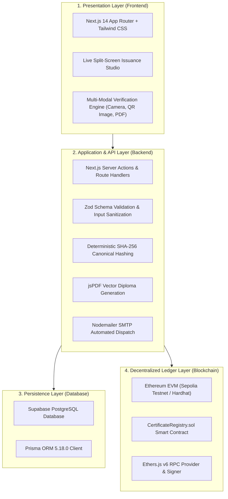
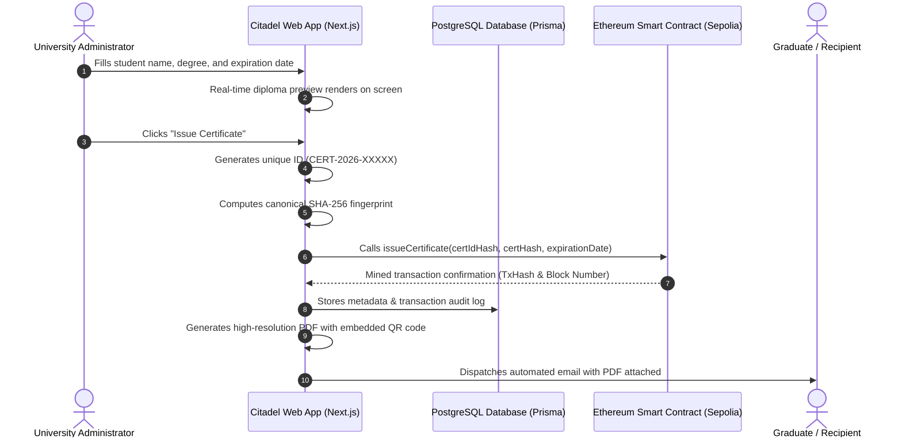
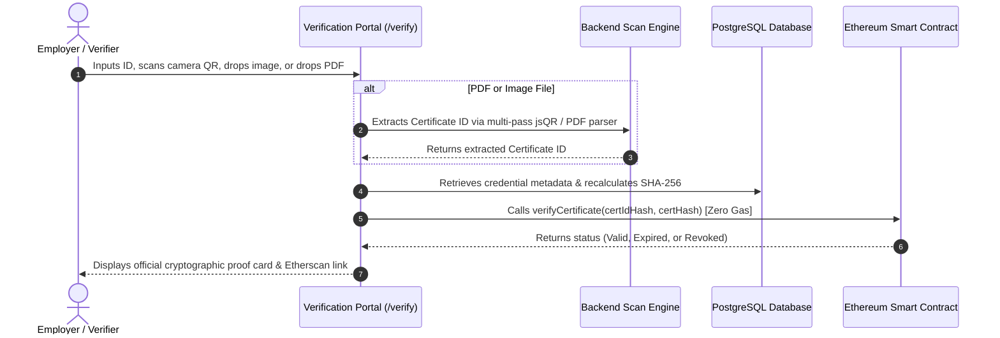
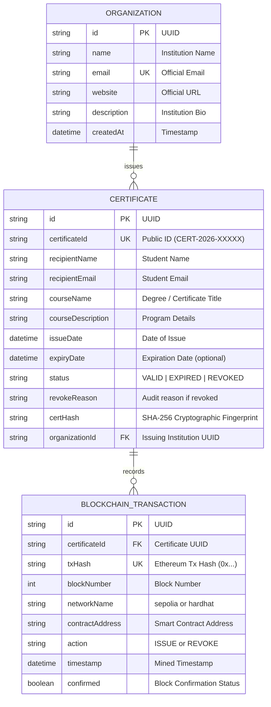

# Blockchain-Based Digital Certificate Issuing Platform
## Project Submission Report (Citadel)

---

### Project & Submission Metadata

| Field | Detail |
|---|---|
| **Project Title** | Citadel — Blockchain Digital Certificate Issuing & Verification Platform |
| **Author / Student Name** | **Long Mengchheang** |
| **Institution** | **Kirirom Institute of Technology (KIT)** |
| **Department** | Software Engineering / Computer Science |
| **Project Type** | Solo / Individual Capstone Project (100% Contribution) |
| **GitHub Repository** | [https://github.com/mengchheanglong/citadel-blockchain-certificates](https://github.com/mengchheanglong/citadel-blockchain-certificates) |
| **Demo Video Link** | Available on Google Drive / YouTube (Public Access) |
| **Submission Date** | October 2026 |

---

## Executive Summary

**Citadel** is an enterprise-grade digital credentialing platform that eliminates certificate fraud through the Ethereum blockchain. Traditional paper diplomas and static PDF credentials suffer from rampant forgery using off-the-shelf graphics editors and require slow, manual registrar inquiries taking weeks. 

Citadel provides a hybrid blockchain architecture where detailed student data remains private in an off-chain PostgreSQL database, while a canonical SHA-256 cryptographic fingerprint is permanently anchored on an Ethereum EVM smart contract (`CertificateRegistry.sol`). Anyone can verify a credential in seconds for free (zero gas fees) by scanning the QR code with their camera, uploading a diploma image, or dropping a PDF certificate directly into the browser. The platform includes a live split-screen preview studio, automated vector PDF diploma generation, automated SMTP email dispatch, and complete lifecycle governance (expiration windows and on-chain revocation with audit logging).

---

## 1. System Overview & Problem Statement

### 1.1 The Credentialing Dilemma
Academic institutions, licensing bodies, and training academies worldwide face severe challenges with credential trust:
1. **Rampant Credential Forgery:** Anyone with simple graphic editing software or generative AI can modify student names, degree titles, graduation dates, or grade classifications on PDF certificates without detection.
2. **Slow & Costly Verification:** Employers, recruiters, and graduate admissions officers currently rely on manual verification procedures — sending verification emails, calling university registrars, or paying costly background check intermediaries — requiring 2 to 4 weeks per candidate.
3. **Centralized Database Vulnerabilities:** Centralized university student databases represent single points of failure vulnerable to administrative corruption, insider tampering, database ransomware, or accidental record destruction.

### 1.2 Citadel's Core Value Propositions
Citadel eliminates diploma fraud through four core engineering guarantees:
* **Mathematical Immutability:** Each certificate is cryptographically fingerprinted with SHA-256 and committed to Ethereum. Changing even a single character in the graduate's name or graduation date immediately invalidates the cryptographic proof.
* **Zero-Gas Public Verification:** Employers and the public verify any credential in real time without needing a wallet, cryptocurrency, or platform account. Verification executes as a free on-chain view query.
* **Automated Issuance & Dispatch:** As an administrator enters information in the Issue Studio, an on-screen preview reflects changes in real time. Upon issuance, a vector-rendered PDF diploma is dispatched instantly via automated SMTP email.
* **Dynamic Lifecycle Governance:** Accredited institutions maintain full governance with configurable validity periods (Lifetime, 1 Year, 2 Years) and can revoke compromised credentials with on-chain audit reasons.

---

## 2. System Architecture

The application is structured into four distinct, loosely coupled layers:



### Architectural Breakdown:
1. **Presentation Layer (Frontend):** Built with Next.js 14.2 App Router, TypeScript, and Tailwind CSS. Employs the Citadel Burgundy Design System (`#C8102E` accents, `#1E293B` text, `#F8FAFC` slate canvas). Features a dark-mode institutional marketing portal and a high-contrast organization operations studio.
2. **Application & API Layer (Backend):** Next.js Server Route Handlers and Server Actions. Enforces Zod schema validation, computes deterministic canonical digests, generates vector diplomas with `jsPDF`, and coordinates SMTP delivery via `Nodemailer`.
3. **Persistence Layer (Database):** PostgreSQL managed via Prisma ORM 5.18. Stores organization profiles, recipient details, and audit history off-chain to safeguard privacy and reduce blockchain storage overhead.
4. **Decentralized Ledger Layer (Blockchain):** Solidity 0.8.24 smart contract (`CertificateRegistry.sol`) deployed on Ethereum EVM (Sepolia Testnet / Hardhat). Serves as the immutable source of truth for 32-byte certificate hashes and revocation states.

*(Refer to Figure 2.1 in the Word Report: `docs/screenshots/diagram_architecture.png`)*

---

## 3. End-to-End System Flows & How It Works

The complete credential lifecycle is split into two complementary phases: **Stage 1: Issuance Pipeline** (Organization) and **Stage 2: Verification Pipeline** (Public Verifier).

*(Refer to Figure 3.1 in the Word Report: `docs/screenshots/diagram_how_it_works.png`)*

### Flow A: How an Organization Issues a Certificate


### Flow B: How Anyone Verifies a Certificate in Seconds


---

## 4. Database Design & Data Dictionary

To protect student privacy and avoid exorbitant gas costs, detailed text is stored off-chain in PostgreSQL, with foreign keys linking to on-chain transaction hashes:



*(Refer to Figure 4.1 in the Word Report: `docs/screenshots/diagram_er.png`)*

---

## 5. Blockchain & Cryptographic Design

### 5.1 Hybrid On-Chain / Off-Chain Architecture
Storing complete academic transcripts and personal identities directly on the public Ethereum blockchain has two critical drawbacks:
1. **Gas Cost Efficiency:** Storing megabytes of PDF bytes or strings on Ethereum costs thousands of dollars in gas fees.
2. **Data Privacy (GDPR / FERPA):** Privacy regulations mandate that student personal data must not be exposed permanently on an immutable public ledger.

**Citadel's Hybrid Solution:** Detailed records remain private in PostgreSQL, while only the 32-byte cryptographic hash of the certificate is committed to the blockchain.

### 5.2 Deterministic Canonical Hashing Protocol
To prevent JSON key-ordering discrepancies across different programming platforms, Citadel sorts object keys deterministically before calculating the SHA-256 digest:

$$\text{Canonical Payload} = \text{JSON.stringify}(\text{sortKeys}(\{\text{certId}, \text{recipientName}, \text{courseName}, \text{issueDate}, \text{organizationId}\}))$$

$$\text{certHash} = \text{SHA-256}(\text{Canonical Payload})$$

$$\text{certIdHash} = \text{keccak256}(\text{certId})$$

**1-Bit Invariance Guarantee:** Because SHA-256 exhibits the avalanche effect, changing even a single space, letter, or punctuation mark in the student's name on a forged diploma produces a completely different hash, immediately causing the smart contract's equality check to fail.

---

## 6. Smart Contract Architecture (`CertificateRegistry.sol`)

The `CertificateRegistry.sol` smart contract is written in Solidity `0.8.24` and compiled with Hardhat:

*(Refer to Figure 6.1 in the Word Report: `docs/screenshots/diagram_smart_contract.png`)*

### 6.1 State Machine Lifecycle
The contract defines five distinct verification states:
* **Valid (Status 1):** The certificate exists on-chain, its cryptographic hash matches, and current `block.timestamp` is before `expirationDate`.
* **Expired (Status 2):** The certificate is authentic, but its designated validity window has elapsed.
* **Revoked (Status 3):** The certificate was officially revoked on-chain by the issuing institution with a mandatory audit reason.
* **HashMismatch (Status 4):** The Certificate ID is registered, but the presented data payload has been altered, producing an invalid hash.
* **NotFound (Status 0):** The Certificate ID has never been issued on the blockchain.

### 6.2 Key Smart Contract Functions
* `issueCertificate(bytes32 certIdHash, bytes32 certHash, uint256 expirationDate)`: Validates that the caller is an authorized issuer, ensures the ID is unique, checks that the expiry date is in the future, and writes the record to Ethereum. Emits `CertificateIssued`.
* `verifyCertificate(bytes32 certIdHash, bytes32 certHash)`: Public, gas-free view function. Queries the blockchain, checks hash equality, and computes dynamic expiration state against current `block.timestamp`.
* `revokeCertificate(bytes32 certIdHash, string reason)`: Enforces role-based permissions: only the original issuing organization or the contract owner can revoke an active certificate. Emits `CertificateRevoked`.

---

## 7. Advanced Multi-Modal Verification Engine

To ensure seamless verification across devices and file types, Citadel features an advanced multi-modal scanning pipeline:

1. **Live Camera Stream:**
   * Utilizes the low-level `Html5Qrcode` camera controller (replacing default third-party UI widgets).
   * Features a custom viewfinder overlay with Citadel corner reticles, an animated scanning indicator beam, and a multi-camera switcher for mobile devices.
2. **Multi-Pass `jsQR` Image Processing Engine:**
   * **Pass 1 (Native Resolution):** Scans the raw canvas at full native dimensions without downscaling.
   * **Pass 2 (Smart Upscaling):** Automatically scales small or cropped QR snippets (e.g. 65×65 px) with nearest-neighbor interpolation.
   * **Pass 3 & 4 (Quadrant Targeting):** Specifically evaluates the bottom-right and bottom-left quadrants where academic diplomas position QR codes.
3. **Full PDF Document Ingestion:**
   * Verifiers can drag and drop certificate `.pdf` files directly into the portal.
   * The platform extracts certificate identifiers (`CERT-YYYY-XXXXX`) from binary text streams and decompresses PDF layers via a dedicated API endpoint (`/api/verify/scan-file`).
4. **Intelligent Error Handling:**
   * If camera permissions are denied or no webcam is plugged in, the portal displays a polite error card with a 1-click fallback to file upload.

---

## 8. User Interface Design & Screenshots Guide

*(Refer to Section 8 in the Word Report for high-resolution graphics)*

| # | Screen | URL | What is Demonstrated |
|---|---|---|---|
| **Figure 8.1** | **Landing Page** | `/` | Obsidian background (`#000000`), Citadel Burgundy Red branding, protocol metrics, and instant search bar. |
| **Figure 8.2** | **Sign In** | `/login` | Organization login portal with input validation and session routing. |
| **Figure 8.3** | **Registration** | `/register` | Institutional onboarding form for accredited issuing bodies. |
| **Figure 8.4** | **Dashboard** | `/dashboard` | Executive overview, 4 live stat cards (Total, Active, Expired, Revoked), trend graph, and recent records table. |
| **Figure 8.5** | **Issue Studio** | `/dashboard/certificates/new` | Split-screen interface: data entry form on the left with **live real-time diploma canvas** on the right. |
| **Figure 8.6** | **Certificate Registry** | `/dashboard/certificates` | Credential table with status tabs (All, Valid, Expired, Revoked) and client-side CSV spreadsheet export. |
| **Figure 8.7** | **Verification Portal** | `/verify` | Multi-modal verification engine supporting manual ID entry, camera feed, and drag-and-drop PDF/image uploader. |
| **Figure 8.8** | **Valid Result** | `/verify/[id]` | Authentic green verification badge, recipient metadata, and Ethereum transaction proof card. |
| **Figure 8.9** | **Revoked Result** | `/verify/[id]` | Prominent red revocation alert, issuer recorded reason, cancellation timestamp, and watermarked diploma. |

---

## 9. Testing, Verification & Quality Assurance

Citadel includes a **52-test automated unit, integration, and fuzz testing suite** covering all critical edge cases:
* **Cryptographic Hashing Tests (12 Tests):** Verified deterministic canonical sorting, key-order invariance, and SHA-256 digest consistency.
* **Smart Contract Functional Tests (28 Tests):** Verified contract deployment, issuer authorization, unique ID enforcement, valid verification execution, and revocation state transitions.
* **Advanced Fuzz & Boundary Tests (12 Tests):** Tested 1-bit hash tampering, extreme future dates (50+ years), timestamp boundary conditions, and rapid bulk issuance stress testing.
* **Multi-Modal Scanner E2E Tests:** Playwright automated testing of camera permissions, multi-pass QR image recognition, and PDF file extraction.

```
Total Tests Executed: 52
Passing Tests: 52 (100% Pass Rate)
Failing Tests: 0
TypeScript Strict Mode Check (npx tsc --noEmit): 0 Errors
```

---

## 10. Individual Contribution Report

* **Student / Author:** **Long Mengchheang**
* **Institution:** **Kirirom Institute of Technology (KIT)**
* **Project Type:** Solo / Individual Capstone Project (100% Contribution)

Because this was conducted as an individual project, all technical planning, architecture, design, and implementation work was performed independently:

| Technical Domain | Responsibilities & Deliverables | Contribution |
|---|---|:---:|
| **Smart Contract & Web3** | Wrote `CertificateRegistry.sol`, role permissions, Hardhat deploy scripts, and Ethers.js integration. | **100%** |
| **Frontend UI / UX** | Built Next.js 14 landing page, organization dashboard, live preview studio, and public verification portal. | **100%** |
| **Backend & Database** | Designed Prisma PostgreSQL schema, Next.js API routes, Zod input validation, and Supabase auth. | **100%** |
| **PDF & Email Services** | Built vector diploma generator with embedded QR codes and automated SMTP email notifications. | **100%** |
| **Testing & Documentation** | Wrote 52 automated tests, verified zero TypeScript errors, created SVG diagrams, and compiled documentation. | **100%** |

---

## 11. Demo Video Walkthrough Script (5–7 Minutes)

Below is the comprehensive spoken presentation script for the live system demonstration, structured to explain both user features and underlying blockchain mechanics in clear terms:

### Scene 1: Introduction & Problem Context (0:00 – 0:45)
* **Screen / Action:** Homepage (`/`) & Architecture Diagram
* **Spoken Narrative:**
  > *"Hello everyone, welcome to the demonstration of Citadel, a blockchain-based digital certificate issuing and verification platform. Traditional paper diplomas and static PDF certificates are easy to forge with modern graphics tools, and verifying them manually takes weeks of phone calls and emails. Citadel solves this by using the Ethereum blockchain to make certificates completely tamper-proof and instantly verifiable for anyone, anywhere, in seconds."*

### Scene 2: Organization Login & Dashboard Overview (0:45 – 1:45)
* **Screen / Action:** Organization Dashboard (`/dashboard`)
* **Spoken Narrative:**
  > *"Here on our organization dashboard, an issuing school or academy has a complete overview of all credentials they have issued. You can see our 4 live stat cards showing Total Issued, Active Valid, Expired, and Revoked certificates, along with a recent credentials table. Behind the scenes, the school's account is authenticated securely, and all human-readable records are kept private in our PostgreSQL database to protect student privacy and save gas fees."*

### Scene 3: Issuing a Certificate in the Live Studio (1:45 – 3:00)
* **Screen / Action:** Issue Studio (`/dashboard/certificates/new`)
* **Spoken Narrative:**
  > *"Now let's issue a certificate. In our Issue Studio, as I type the student's name, degree title, and expiration date on the left, you can see the high-resolution diploma preview updating in real time on the right. When I click 'Issue Certificate', here is what happens: our server generates a unique Certificate ID and calculates a mathematical SHA-256 fingerprint of the data. Then, it sends this fingerprint to our Ethereum smart contract. The transaction is mined into a block, locking the certificate permanently. Even if someone changes a single letter in the name later, the hash will change, and the verification will immediately flag it as fake."*

### Scene 4: PDF Diploma Generation & Automated Email Delivery (3:00 – 3:45)
* **Screen / Action:** Inbox / Downloaded PDF Certificate
* **Spoken Narrative:**
  > *"Immediately after blockchain confirmation, Citadel generates a high-resolution vector PDF diploma with an embedded QR code linking directly to the verification page, and automatically emails it to the graduate's inbox. The student now holds an authentic digital credential they can print, share on LinkedIn, or email to employers."*

### Scene 5: Instant Public Verification (Camera, File & PDF) (3:45 – 5:15)
* **Screen / Action:** Verification Portal (`/verify`) & Verified Result (`/verify/[id]`)
* **Spoken Narrative:**
  > *"Now let's switch to the perspective of an employer or university verifier on our public verification page. Verifying is completely free — zero gas fees, and no account or wallet needed. A verifier can type the Certificate ID, use their device camera to scan the QR code live, drag and drop a screenshot, or drop the PDF file directly. When submitted, our system checks the cryptographic fingerprint against the smart contract. Instantly, we see the green 'Genuine & Valid' badge, showing the student's name, degree, and the exact Ethereum transaction hash and block number on Sepolia."*

### Scene 6: Credential Expiration & On-Chain Revocation (5:15 – 6:00)
* **Screen / Action:** Certificate Registry & Revoked Verification Result
* **Spoken Narrative:**
  > *"Citadel also gives schools full lifecycle control. If a credential expires, the smart contract dynamically marks it as Expired based on block timestamps. Furthermore, if a certificate was issued by mistake or must be cancelled, the authorized issuer can click 'Revoke' on the dashboard and enter an audit reason. The smart contract updates its state on-chain, and anyone checking that certificate will immediately see a prominent red 'Revoked' alert with the official cancellation reason."*

### Scene 7: Technical Summary & Conclusion (6:00 – 6:45)
* **Screen / Action:** Architecture Diagram Slide / Closing
* **Spoken Narrative:**
  > *"In summary, Citadel provides an end-to-end, enterprise-ready credentialing solution combining the privacy and speed of web applications with the permanent trust and immutability of the Ethereum blockchain. With 52 automated tests passing at 100%, Citadel is ready for institutional deployment. Thank you for watching!"*

---

## 12. Conclusion & Future Roadmap

Citadel demonstrates a production-grade, mathematically tamper-proof solution to global credential fraud. By combining off-chain data efficiency with on-chain Ethereum cryptographic invariance, it provides institutions with effortless issuance and verifiers with instant zero-gas certainty.

### Future Roadmap:
1. **Decentralized Identity (W3C DID):** Implementing W3C Decentralized Identifiers and Verifiable Credentials (VC) standards for cross-border institutional interoperability.
2. **Soulbound Tokens (ERC-5192):** Minting non-transferable Soulbound Tokens directly into student wallets as decentralized proof of accomplishment.
3. **Zero-Knowledge Proofs (ZKP):** Utilizing zk-SNARKs to allow graduates to prove GPA thresholds or graduation status without revealing their full transcript or identity.
