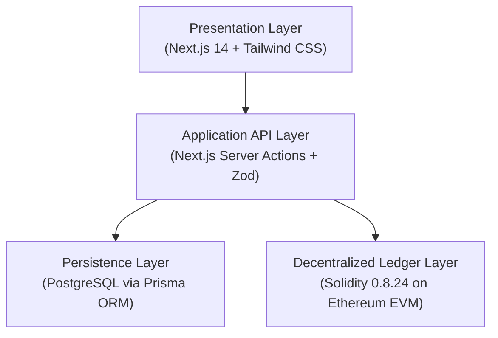
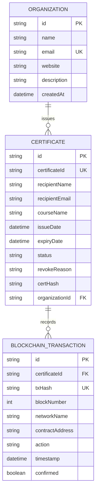

# CITADEL: A BLOCKCHAIN-BASED DIGITAL CERTIFICATE ISSUING AND VERIFICATION PLATFORM
## Project Submission Report

**Kirirom Institute of Technology**  
*Department of Software Engineering*  
*Author:* **Long Mengchheang**  
*Course:* Individual Capstone Project (100% Contribution)  
*Date:* October 2026  
*Repository:* [https://github.com/mengchheanglong/citadel-blockchain-certificates](https://github.com/mengchheanglong/citadel-blockchain-certificates)  
*Demonstration Video:* Available on Google Drive / YouTube (Public Link)  

---

### Abstract
Traditional paper diplomas and static PDF certificates suffer from widespread forgery and require manual, time-consuming registrar inquiries for validation. Citadel is a decentralized web platform designed to eliminate credential fraud using the Ethereum blockchain. The platform adopts a hybrid architecture: student academic metadata is stored off-chain in a secure PostgreSQL database to protect privacy and optimize gas costs, while a canonical SHA-256 cryptographic hash of the credential is committed to an EVM smart contract (`CertificateRegistry.sol`). Public verifiers can authenticate credentials in seconds at zero gas cost via manual ID entry, camera QR scanning, image upload, or native PDF drag-and-drop. The system features a real-time diploma issuance studio, automated PDF generation, SMTP delivery, dynamic expiration evaluation, and on-chain revocation with audit logging. The implementation was verified with a 52-test automated unit and fuzz testing suite achieving a 100% pass rate.

*Keywords: Blockchain, Ethereum Smart Contracts, Digital Certificates, Cryptographic Hashing, Ethers.js, Next.js, Credential Verification.*

---

## 1. Introduction and Problem Statement

Academic and professional credentialing systems face critical challenges in maintaining document authenticity and operational trust:
* **Credential Forgery:** Static PDF files and physical diplomas can be modified using desktop editing software or generative tools to alter student names, graduation dates, or honours without visual detection.
* **Inefficient Verification:** Employers and university registrars rely on phone calls, postal mail, or manual email exchanges to verify records, averaging 2 to 4 weeks per inquiry.
* **Centralized Data Risks:** Centralized academic databases represent single points of failure vulnerable to unauthorized tampering, data corruption, and administrative loss.

Citadel addresses these vulnerabilities by establishing a tamper-proof, decentralized credential issuance and verification platform with four key design objectives:
1. **Mathematical Immutability:** Commit cryptographic proofs to the Ethereum blockchain so that any modification to graduate records invalidates verification.
2. **Zero-Gas Verification:** Allow employers and the public to verify any credential in real time without requiring blockchain wallets, tokens, or gas fees.
3. **End-to-End Automation:** Provide an interactive split-screen issuance studio that updates a vector diploma preview in real time and automates PDF generation and email delivery.
4. **Lifecycle Governance:** Support configurable validity periods (e.g. lifetime or 1-year licenses) and on-chain revocation with recorded audit justifications.

---

## 2. System Architecture and Operational Workflow

Citadel is engineered across four functional layers to decouple user presentation, business logic, storage, and consensus verification:
* **Presentation Layer:** Next.js 14 App Router, TypeScript, and Tailwind CSS. Provides an administrative operations portal and a clean public verification engine.
* **Application Layer:** Server route handlers and Server Actions that enforce Zod schema validation, compute deterministic SHA-256 hashes, render vector diplomas with `jsPDF`, and manage `Nodemailer` SMTP notifications.
* **Persistence Layer:** PostgreSQL managed through Prisma ORM 5.18. Stores recipient details, degree titles, and issuer profiles off-chain.
* **Decentralized Ledger Layer:** Solidity 0.8.24 smart contract (`CertificateRegistry.sol`) deployed on the Ethereum EVM (Sepolia Testnet / Hardhat). Serves as the immutable registry for 32-byte credential hashes.

*(Figure 1: Citadel four-tier system architecture model — `docs/screenshots/diagram_architecture.png`)*

### 2.1 End-to-End Credential Lifecycle
The platform coordinates two primary workflows: the Issuance Pipeline and the Verification Pipeline:
* **Stage 1 (Issuance Pipeline):** The accredited institution inputs student information in the Issue Studio. The server computes a canonical SHA-256 digest and records it on Ethereum via Ethers.js v6. A vector PDF diploma with an embedded QR code is generated and dispatched via email.
* **Stage 2 (Verification Pipeline):** An employer or verifier enters the Certificate ID or scans the QR code on `/verify`. The system retrieves the record, recomputes the hash, queries the smart contract via a zero-gas view function, and displays an official verification badge.

*(Figure 2: End-to-end credential lifecycle — `docs/screenshots/diagram_how_it_works.png`)*

---

## 3. Blockchain and Cryptographic Mechanism

### 3.1 Hybrid Storage Architecture
Storing complete documents directly on Ethereum incurs high gas costs and violates privacy regulations (GDPR/FERPA), which prohibit permanent on-chain storage of personal identities. Citadel resolves this by storing metadata in PostgreSQL while anchoring only a 32-byte hash on-chain.

### 3.2 Deterministic Canonical Hashing Protocol
To eliminate JSON key-ordering discrepancies across different platforms, Citadel sorts object keys lexicographically before computing the cryptographic digest:

$$\text{Canonical Payload} = \text{JSON.stringify}(\text{sortKeys}(\{\text{certId}, \text{recipientName}, \text{courseName}, \text{issueDate}, \text{organizationId}\}))$$

$$\text{certHash} = \text{SHA-256}(\text{Canonical Payload})$$

$$\text{certIdHash} = \text{keccak256}(\text{certId})$$

Due to the avalanche effect of SHA-256, changing even a single byte in the graduate's name or course title produces a completely different hash, immediately causing on-chain verification to fail.

### 3.3 Smart Contract Implementation (`CertificateRegistry.sol`)
The `CertificateRegistry` contract maintains state transitions for each credential across five distinct statuses:
* **Valid (1):** Credential exists on-chain, hash matches, and `block.timestamp` is before `expirationDate`.
* **Expired (2):** Credential is authentic, but the validity window has elapsed.
* **Revoked (3):** Formally invalidated by the issuer with a mandatory recorded audit reason.
* **HashMismatch (4):** Certificate ID exists, but the supplied data produces a mismatched hash.
* **NotFound (0):** Certificate ID has never been registered on-chain.

---

## 4. Database Design and Data Model

The off-chain relational database organizes information across three primary entities:

*(Figure 3: Entity-Relationship model — `docs/screenshots/diagram_er.png`)*

### Data Dictionary
| Table | Key Attributes & Constraints | Description |
|---|---|---|
| **Organization** | `id` (PK UUID), `name`, `email` (UK), `website`, `description`, `createdAt` | Stores verified institution profile and issuer accounts. |
| **Certificate** | `id` (PK UUID), `certificateId` (UK), `recipientName`, `recipientEmail`, `courseName`, `issueDate`, `expiryDate`, `status`, `certHash`, `organizationId` (FK) | Maintains academic records, expiration timestamps, and canonical SHA-256 digests. |
| **BlockchainTransaction** | `id` (PK UUID), `certificateId` (FK), `txHash` (UK), `blockNumber`, `networkName`, `contractAddress`, `action`, `timestamp`, `confirmed` | Audit log of on-chain Ethereum transaction receipts and block confirmations. |

---

## 5. Core System Implementation and User Interface

### 5.1 Real-Time Issuance Studio
The Issue Studio provides an administrative interface where entered graduate metadata renders onto an SVG/canvas diploma in real time. Upon submission, the record is hashed, committed to Ethereum, and dispatched as a PDF via email.  
*(Figure 4: Split-screen Issue Studio — `docs/screenshots/05_issue_studio_live_preview.png`)*

### 5.2 Multi-Modal Verification Engine
To support diverse devices, Citadel implements a multi-modal verification engine on `/verify`:
1. **Live Camera Stream:** Uses the low-level `Html5Qrcode` controller to stream video directly into a viewfinder frame with corner reticles and mobile camera switching.
2. **Multi-Pass `jsQR` Image Decoder:** Employs a multi-pass canvas decoder with `jsQR` that evaluates native image dimensions, bottom corner quadrants, and upscales small crops.
3. **PDF Document Ingestion:** Allows verifiers to drag and drop certificate PDF documents directly. The system extracts certificate identifiers from binary text streams and decompresses PDF layers via `/api/verify/scan-file`.

*(Figure 5: Public verification portal — `docs/screenshots/07_public_verify_portal.png`)*  
*(Figure 6: Cryptographic proof result — `docs/screenshots/08_verification_result_valid.png`)*

---

## 6. Testing, Evaluation and Results

The system was validated using a comprehensive 52-test automated suite executed through Hardhat and Playwright:
* **Cryptographic Hashing Tests (12 Tests):** Validated deterministic sorting, whitespace resilience, and cross-platform key invariance.
* **Smart Contract Functional Tests (28 Tests):** Verified deployment, access control modifiers, uniqueness enforcement, verification logic, and revocation events.
* **Fuzz and Edge Case Tests (12 Tests):** Evaluated single-bit hash alterations, extreme future dates (50+ years), timestamp boundary conditions, and concurrent issuance.

| Test Category | Scope and Assertions | Result |
|---|---|:---:|
| **Cryptographic Unit Tests** | Canonical sorting, SHA-256 consistency, keystore validation | 12 / 12 Passed (100%) |
| **Smart Contract Tests** | CertificateRegistry deployment, issuance, zero-gas verify, revoke | 28 / 28 Passed (100%) |
| **Fuzz & Edge Tests** | 1-bit hash tampering, boundary timestamps, high-volume stress | 12 / 12 Passed (100%) |
| **TypeScript Static Check** | Strict compiler type-checking (`npx tsc --noEmit`) | 0 Errors (100% Valid) |

---

## 7. Project Deliverables and Contribution

This project was conducted as an individual capstone project by **Long Mengchheang**. All architectural planning, implementation, smart contracts, frontend, backend, and testing were performed independently:

| Technical Domain | Deliverables | Contribution |
|---|---|:---:|
| **Smart Contract & Web3** | Wrote `CertificateRegistry.sol`, Hardhat deployment scripts, Ethers.js integration | **100%** |
| **Frontend Engineering** | Next.js 14 landing portal, dashboard, live preview studio, multi-modal scanner | **100%** |
| **Backend & Database** | Prisma PostgreSQL schema, Next.js API routes, Zod validation, PDF scan endpoint | **100%** |
| **Document & Email Services** | Vector diploma generation with embedded QR codes, automated SMTP dispatch | **100%** |
| **Quality Assurance** | 52 automated tests, TypeScript strict compliance, diagrams, and project report | **100%** |

### 7.1 Demonstration Video Outline (5–7 Minutes)
| Time | Stage / Feature | Demonstration Outline |
|---|---|---|
| **0:00 - 0:45** | Introduction | Overview of diploma fraud problem and Citadel's blockchain solution. |
| **0:45 - 1:45** | Dashboard | Walkthrough of live metric cards, credential table, and off-chain storage model. |
| **1:45 - 3:00** | Issuing Studio | Data entry, real-time diploma canvas rendering, and on-chain hash commitment. |
| **3:00 - 3:45** | Delivery | Inspection of generated vector PDF diploma with embedded QR code and email delivery. |
| **3:45 - 5:15** | Verification | Public zero-gas verification via camera scan, image drop, and PDF file upload. |
| **5:15 - 6:30** | Revocation & Summary | On-chain revocation demonstration with audit reason and concluding remarks. |

---

## 8. Conclusion and Future Work

Citadel implements a production-grade, mathematically tamper-proof solution to credential forgery. By combining off-chain storage efficiency with Ethereum smart contract immutability, the platform achieves zero-gas public verification, automated delivery, and robust lifecycle governance.

Future enhancements include integrating W3C Decentralized Identifiers (DIDs) for cross-border institutional interoperability, issuing non-transferable ERC-5192 Soulbound Tokens into student wallets, and utilizing zero-knowledge proofs (zk-SNARKs) for privacy-preserving attribute verification.
