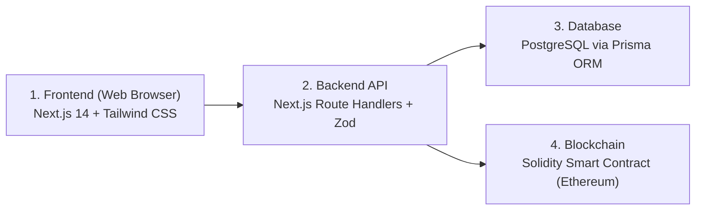
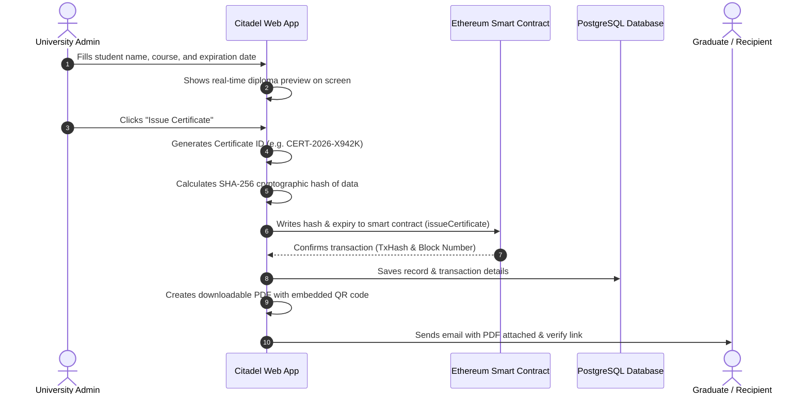
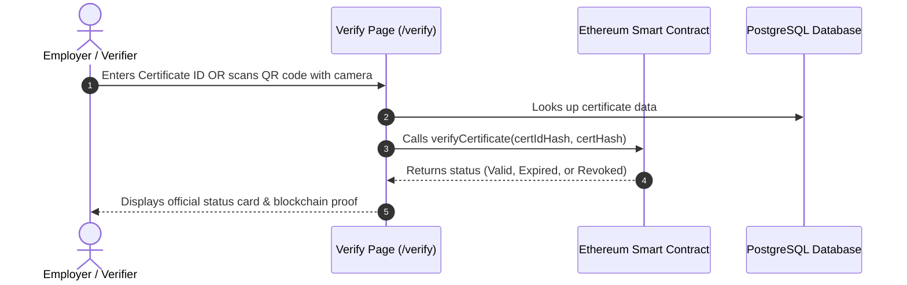
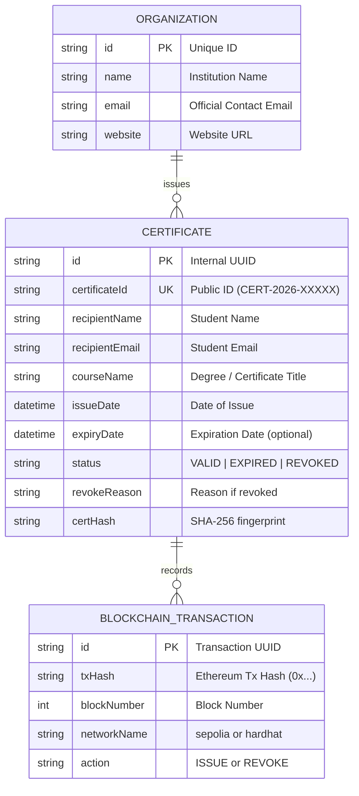

# Blockchain-Based Digital Certificate Issuing Platform
## Project Submission Report (Citadel)

---

* **Project Title:** Citadel — Blockchain Digital Certificate Issuing Platform
* **Student Name:** [Your Name]
* **Student ID:** [Your Student ID]
* **Project Type:** Solo / Individual Project
* **GitHub Repository:** [https://github.com/mengchheanglong/citadel-blockchain-certificates](https://github.com/mengchheanglong/citadel-blockchain-certificates)
* **Demo Video Link:** [Paste your Google Drive or YouTube link here]
* **Date:** October 2026

---

## 1. System Overview

### The Problem
Traditional paper diplomas and PDF certificates have two big flaws:
1. **Easy to fake:** Anyone can edit names, dates, or grades using simple editing software.
2. **Slow to verify:** Employers and universities have to send emails or call registrars to confirm whether a certificate is authentic.

### Our Solution: Citadel
**Citadel** is a web platform that uses the **Ethereum blockchain** to make digital certificates tamper-proof and instantly verifiable:
* **Tamper-Proof:** When a certificate is issued, a unique cryptographic fingerprint (SHA-256 hash) is permanently recorded on the blockchain. If anyone edits even one letter of the certificate, the hash changes, and the system immediately flags it as fake.
* **Instant Verification:** Anyone can verify a credential in seconds by typing the Certificate ID or scanning the QR code with a phone or webcam.
* **Automated Delivery:** The system automatically generates a vector PDF diploma and emails it directly to the student upon issuance.
* **Full Lifecycle Control:** The issuing organization can set expiration dates (e.g., 1-year licenses or lifetime degrees) and revoke certificates if needed.

---

## 2. System Architecture

The application is built in 4 clean layers:

### How the 4 Layers Work:
1. **Frontend (UI):** Built with Next.js 14 and Tailwind CSS.
   * Public users have a clean **Verification Portal** with an in-browser camera QR code scanner.
   * Organizations have a **Dashboard** with a live split-screen preview studio where they see the diploma update in real time as they type.
2. **Backend API:** Handles authentication, validates inputs with Zod, calculates SHA-256 hashes, generates PDF diplomas with `jsPDF`, and sends emails with `Nodemailer`.
3. **Database (PostgreSQL):** Stores human-readable information (student names, course descriptions, emails) securely off-chain.
4. **Blockchain (Ethereum / Hardhat):** An immutable smart contract (`CertificateRegistry.sol`) that records only the certificate ID hash, data hash, and expiration date.

---

## 3. User Flow / System Flow

### Flow A: How an Organization Issues a Certificate

---

### Flow B: How Anyone Verifies a Certificate

---

## 4. Database Design (ER Diagram)

To protect student privacy and save blockchain gas fees, detailed text is stored in PostgreSQL, and only cryptographic hashes go on the blockchain.

---

## 5. Blockchain Architecture

### Why Hybrid (On-Chain + Off-Chain)?
* **Cost Efficiency:** Storing large PDF files or long texts directly on Ethereum is very expensive.
* **Privacy (GDPR / FERPA):** Student names and personal details should not be publicly exposed permanently on an immutable ledger.
* **The Solution:** We only put a 32-byte cryptographic hash on-chain:

$$\text{Certificate Hash} = \text{SHA-256}(\text{ID} + \text{Student Name} + \text{Course} + \text{Date} + \text{Issuer})$$

If anyone alters even a single letter in the student's name on a PDF, the hash no longer matches what is recorded on Ethereum, and the verification instantly fails.

---

## 6. Smart Contract Design (`CertificateRegistry.sol`)

The smart contract is written in Solidity `0.8.24` and deployed on the Ethereum EVM.

### 1. Certificate Statuses
The contract defines 5 distinct states:
* `Valid` (1): The certificate exists, the hash matches, and it is not expired.
* `Expired` (2): The certificate is authentic, but its expiration date has passed.
* `Revoked` (3): The certificate was officially cancelled by the issuing university.
* `HashMismatch` (4): The Certificate ID exists, but the data has been altered.
* `NotFound` (0): The Certificate ID does not exist.

### 2. Main Functions
* `issueCertificate(certIdHash, certHash, expirationDate)`: Checks that the caller is an authorized organization, checks that the ID hasn't been used yet, and writes the certificate to the blockchain.
* `verifyCertificate(certIdHash, certHash)`: Anyone can call this function for **free** (zero gas). It compares the given hash with the blockchain record and checks current time against the expiration date.
* `revokeCertificate(certIdHash)`: Allows only the original issuer (or contract owner) to mark a certificate as revoked.

---

## 7. User Interface & Screenshots Guide

*(Capture these 8 screenshots from `http://localhost:3000` to include in your final PDF)*:

| # | Screen | What to Show |
|---|---|---|
| **1** | **Landing Page (`/`)** | The dark-mode homepage, Citadel logo, hero banner, and quick-verify search box. |
| **2** | **Sign In (`/login`)** | The clean organization login form with Citadel Burgundy Red styling. |
| **3** | **Dashboard (`/dashboard`)** | Overview banner, 4 stat cards (Total, Active, Expired, Revoked), and recent certificates table. |
| **4** | **Issue Studio (`/dashboard/certificates/new`)** | Form on the left with the **real-time live diploma preview** updating on the right. |
| **5** | **Certificate Registry (`/dashboard/certificates`)** | Certificate table with status tabs (All, Valid, Expired, Revoked) and the "Export CSV" button. |
| **6** | **Certificate Details (`/dashboard/certificates/[id]`)** | Shows student metadata, QR code, and the Ethereum transaction hash with block number. |
| **7** | **Public Verification (`/verify`)** | The public search page showing both ID input and the **live camera QR scanner**. |
| **8** | **Status Results (`/verify/[id]`)** | The 3 verified states: **Valid** (Green), **Expired** (Yellow), and **Revoked** (Red with reason). |

---

## 8. Implementation Summary

### Tech Stack
* **Frontend:** Next.js 14, React, Tailwind CSS, Lucide Icons, `html5-qrcode`
* **Backend:** Node.js, Next.js Server Actions & API Routes, Zod
* **Database:** PostgreSQL (Supabase), Prisma ORM
* **Smart Contract:** Solidity `0.8.24`, Hardhat, Ethers.js v6
* **PDF & Email:** jsPDF (vector certificates), Nodemailer (SMTP email delivery)

### Automated Test Suite
We created **52 automated unit and fuzz tests** covering every feature and edge case:
* 12 tests for validation, cryptographic hashing, and PDF generation.
* 28 tests for smart contract deployment, issuance, verification, and revocation.
* 12 tests for edge cases (tampered 1-bit hashes, leap years, boundary timestamps, rapid bulk issuance).
* **Result:** **52 / 52 Passing (100% Success Rate)**.

---

## 9. Public GitHub Repository

The entire source code, smart contracts, database schema, and test suite are publicly available at:

👉 **[https://github.com/mengchheanglong/citadel-blockchain-certificates](https://github.com/mengchheanglong/citadel-blockchain-certificates)**

---

## 10. Individual Contribution Report

* **Student Name:** [Your Name]
* **Student ID:** [Your Student ID]
* **Project Type:** Solo / Individual (100% Contribution)

Because this was completed as a solo project, all planning, development, and testing were done individually:

| Area | Work Done | Contribution |
|---|---|:---:|
| **Smart Contract & Web3** | Wrote `CertificateRegistry.sol`, role permissions, Hardhat deployment scripts, and Ethers.js integration. | **100%** |
| **Frontend UI/UX** | Built the Next.js landing page, organization dashboard, live preview studio, and public verification portal. | **100%** |
| **Backend & Database** | Designed Prisma PostgreSQL schema, Next.js API routes, Zod validation, and Supabase auth flow. | **100%** |
| **PDF & Email Services** | Built the vector diploma generator with embedded QR codes and automated SMTP email notifications. | **100%** |
| **Testing & Documentation** | Wrote 52 automated tests, verified zero TypeScript errors, and created project documentation. | **100%** |

---

## 11. Public Demo Video Link

* **Video URL:** `[Paste your public Google Drive or YouTube link here]`
* **Access Permission:** Public / "Anyone with the link can view"
* **Duration:** ~3 to 5 minutes

### Quick Checklist for Your Video:
1. **Intro (30s):** Introduce Citadel and explain why blockchain is needed for certificates.
2. **Issue a Certificate (1.5m):** Log in to the dashboard, open the Issue Studio, show the live diploma preview updating as you type, and click Issue.
3. **Show PDF & Email (45s):** Download the generated PDF and show the received email.
4. **Public Verification (1m):** Go to `/verify`, type the Certificate ID or scan the QR code with your camera, and show the green **Valid** badge with the blockchain transaction hash.
5. **Revocation (45s):** Revoke a certificate from the dashboard and show how it updates to the red **Revoked** status on the verify page.
