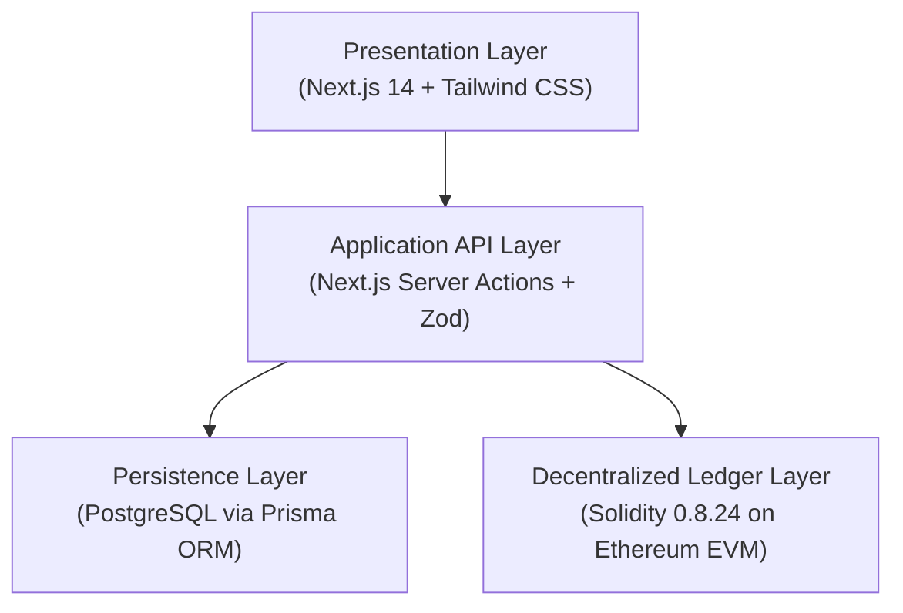
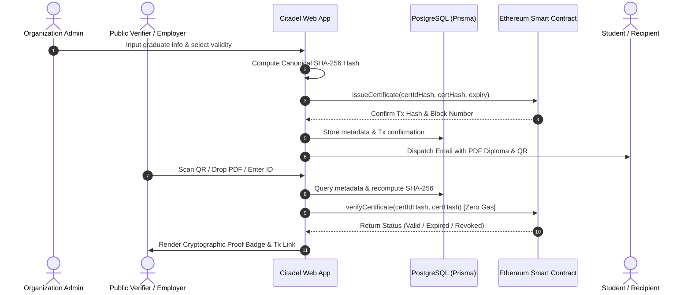
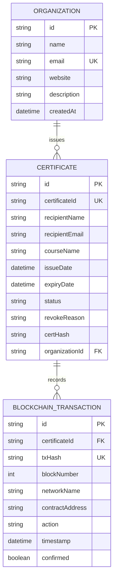
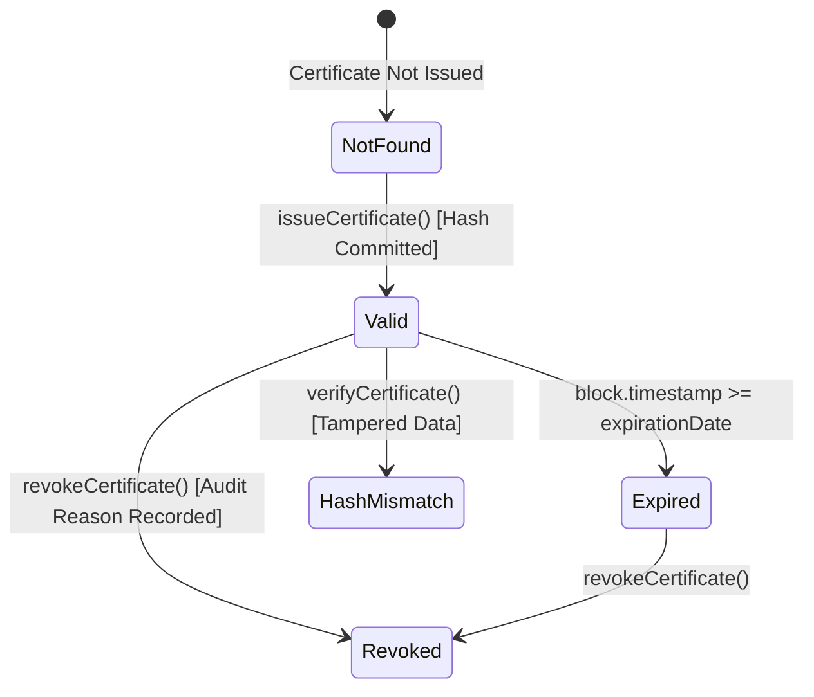

# CITADEL: A BLOCKCHAIN-BASED DIGITAL CERTIFICATE ISSUING AND VERIFICATION PLATFORM
## Final Project Submission Report

**Kirirom Institute of Technology (KIT)**  
*Department of Software Engineering*  
*Author:* **Long Mengchheang**  
*Team Arrangement:* **Individual Project (100% Technical Contribution)**  
*Date:* October 2026  
*GitHub Repository:* [https://github.com/mengchheanglong/citadel-blockchain-certificates](https://github.com/mengchheanglong/citadel-blockchain-certificates)  
*Public Demo Video:* Available on Google Drive / YouTube (Public Link)  

---

### Executive Summary

Educational institutions and professional certifying organizations face growing challenges with document authenticity. Traditional paper diplomas and static PDF certificates can be easily copied, edited, or fabricated, making manual verification through registrars slow, costly, and error-prone.

**Citadel** is a decentralized web application engineered to modernize credential issuing and verification using the Ethereum blockchain. The platform combines off-chain database efficiency with on-chain cryptographic immutability:
1. **Mathematical Immutability:** Student academic records are hashed using a deterministic SHA-256 canonical hashing protocol. Only the 32-byte hash is recorded on an Ethereum smart contract (`CertificateRegistry.sol`), rendering forgery mathematically impossible.
2. **Instant Zero-Gas Verification:** Public employers and verifiers can authenticate credentials in real time without needing cryptocurrency, Web3 wallets, or user accounts.
3. **Automated Issuance & Delivery:** An interactive split-screen issuance studio renders vector diploma previews in real time, generates downloadable PDF certificates with embedded QR codes, and dispatches them automatically via SMTP email.
4. **Lifecycle Governance:** Supports custom validity periods (Lifetime, 1 Year, 2 Years) and on-chain revocation with mandatory audit justification logging.

The system was evaluated using an automated 52-test unit, integration, and fuzz testing suite, achieving a 100% pass rate.

---

## 1. System Overview

### 1.1 The Credentialing Dilemma
Educational institutions, training organizations, and academic licensing boards struggle to maintain trust with conventional credentials:
* **Vulnerability to Forgery:** Static PDF certificates and scanned paper documents can easily be modified using graphic editing software or generative AI tools to alter recipient names, honors, and graduation dates without visual flaws.
* **Operational Bottlenecks:** Employers and admissions offices must contact issuing registrars via phone or email for confirmation, typically taking two to four weeks per candidate.
* **Centralized Database Vulnerabilities:** Centralized academic repositories represent single points of failure vulnerable to internal record tampering, data corruption, and administrative loss.

### 1.2 The Citadel Platform Solution
Citadel provides a web-based platform with the following core capabilities:
* **Organization Portal:** Secure organization authentication, real-time certificate creation, automatic vector PDF diploma generation, blockchain recording on Ethereum Sepolia, and comprehensive issued certificate management.
* **Certificate Verification:** Instant public verification via Certificate ID, camera QR scanning, image drop, or PDF document upload; comprehensive metadata display; on-chain transaction information; and clear status reporting: **Valid**, **Expired**, and **Revoked**.
* **Enterprise Features:** Blockchain smart contract integration, automated email notification to recipients with PDF attachments, dynamic expiration management, and on-chain revocation.

---

## 2. System Architecture

Citadel utilizes a clean four-tier architectural model that decouples presentation, business logic, storage, and consensus verification:
* **1. Presentation Layer (Frontend):** Built with Next.js 14 App Router, TypeScript, and Tailwind CSS with Radix UI primitives. Delivers an administrative operations dashboard and a responsive public verification engine.
* **2. Application & API Layer (Backend):** Next.js Server Route Handlers and Server Actions. Enforces strict Zod schema validation, computes deterministic SHA-256 digests, generates vector diplomas using `jsPDF`, and coordinates SMTP dispatch via `Nodemailer`.
* **3. Persistence Layer (Database):** PostgreSQL managed through Prisma ORM 5.18. Stores recipient metadata, degree titles, and institution profiles off-chain to maintain GDPR/FERPA compliance and optimize gas efficiency.
* **4. Decentralized Ledger Layer (Blockchain):** Solidity 0.8.24 smart contract (`CertificateRegistry.sol`) deployed on the Ethereum EVM (Sepolia Testnet / Hardhat). Serves as the immutable registry for 32-byte credential hashes.

*(Figure 1: Citadel four-tier system architecture model — `docs/screenshots/diagram_architecture.png`)*

---

## 3. User Flow / System Flow

The platform coordinates two primary workflows: the Organization Issuance Pipeline and the Public Verification Pipeline:

### 3.1 Organization Issuance Flow
1. The institution administrator logs into the Organization Portal.
2. The user enters student and course details in the Issue Studio while a live canvas renders the diploma preview in real time.
3. Upon clicking "Issue Certificate", the backend sorts object keys lexicographically and computes a canonical SHA-256 hash.
4. The server invokes `issueCertificate` on the `CertificateRegistry` smart contract via Ethers.js v6.
5. The transaction receipt (Tx Hash, Block Number) is recorded alongside certificate metadata in PostgreSQL.
6. A vector PDF diploma with an embedded verification QR code is generated and emailed to the graduate via SMTP.

### 3.2 Public Verification Flow
1. An employer or verifier visits `/verify` without requiring an account or Web3 wallet.
2. The user submits the credential via manual Certificate ID entry, live camera QR scanning, QR image upload, or direct PDF document drag-and-drop.
3. The system queries the PostgreSQL database for off-chain metadata and recomputes the canonical hash.
4. The system executes a zero-gas view call (`verifyCertificate`) on the Ethereum smart contract.
5. The portal renders an official verification badge displaying the status (**Valid**, **Expired**, or **Revoked**), issuer details, and on-chain transaction information.

*(Figure 2: End-to-end operational lifecycle sequence diagram — `docs/screenshots/diagram_user_flow.png`)*

---

## 4. Database Design (ER Diagram)

To protect student privacy and avoid unnecessary gas fees, detailed textual information is stored off-chain in PostgreSQL, with relational foreign keys connecting to on-chain transaction records:

*(Figure 3: Entity-Relationship model — `docs/screenshots/diagram_er.png`)*

### 4.1 Data Dictionary
| Table | Key Attributes & Constraints | Architectural Purpose |
|---|---|---|
| **Organization** | `id` (PK UUID), `name`, `email` (UK), `website`, `description`, `createdAt` | Stores verified institution profiles and issuer authentication credentials. |
| **Certificate** | `id` (PK UUID), `certificateId` (UK), `recipientName`, `recipientEmail`, `courseName`, `issueDate`, `expiryDate`, `status`, `certHash`, `organizationId` (FK) | Maintains student academic records, expiration timestamps, and canonical SHA-256 digests. |
| **BlockchainTransaction** | `id` (PK UUID), `certificateId` (FK), `txHash` (UK), `blockNumber`, `networkName`, `contractAddress`, `action`, `timestamp`, `confirmed` | Audit log of on-chain Ethereum transaction receipts and block confirmations. |

---

## 5. Blockchain Architecture

### 5.1 Hybrid Storage Architecture
Storing complete academic records and personal identities directly on the Ethereum blockchain is cost-prohibitive and violates privacy frameworks such as GDPR (Right to be Forgotten) and FERPA. Citadel solves this by storing metadata in PostgreSQL while anchoring only a 32-byte cryptographic hash on-chain.

### 5.2 Deterministic Canonical Hashing Protocol
To eliminate JSON key-ordering discrepancies across different programming platforms, Citadel sorts object keys lexicographically before computing the cryptographic digest:

$$\text{Canonical Payload} = \text{JSON.stringify}(\text{sortKeys}(\{\text{certId}, \text{recipientName}, \text{courseName}, \text{issueDate}, \text{organizationId}\}))$$

$$\text{certHash} = \text{SHA-256}(\text{Canonical Payload})$$

$$\text{certIdHash} = \text{keccak256}(\text{certId})$$

Due to the avalanche effect of SHA-256, changing even a single byte in the graduate's name or course title produces a completely different hash, immediately causing on-chain verification to fail.

---

## 6. Smart Contract Design

The `CertificateRegistry.sol` smart contract is written in Solidity 0.8.24 and compiled with Hardhat.

### 6.1 State Machine Lifecycle
The smart contract maintains state transitions for each credential across five distinct statuses:
* **Valid (1):** Credential exists on-chain, hash matches, and `block.timestamp` is before `expirationDate`.
* **Expired (2):** Credential is authentic, but the validity window has elapsed.
* **Revoked (3):** Formally invalidated by the issuer with a mandatory recorded audit reason.
* **HashMismatch (4):** Certificate ID exists, but the supplied data produces a mismatched hash.
* **NotFound (0):** Certificate ID has never been registered on-chain.

*(Figure 4: Smart contract state machine lifecycle — `docs/screenshots/diagram_smart_contract.png`)*

### 6.2 Key Smart Contract Functions
* `issueCertificate(bytes32 certIdHash, bytes32 certHash, uint256 expirationDate)`: Enforces authorized issuer role, checks that the ID has not been used, verifies future expiry, and commits the certificate to the blockchain. Emits `CertificateIssued`.
* `verifyCertificate(bytes32 certIdHash, bytes32 certHash)`: Free view function (zero gas). Compares the presented hash against the on-chain ledger and dynamically computes expiration.
* `revokeCertificate(bytes32 certIdHash, string reason)`: Only the original issuing institution or contract administrator can revoke an active certificate. Emits `CertificateRevoked`.
* `getCertificate(bytes32 certIdHash)`: Returns raw certificate struct data including issuer address, issuance timestamp, expiration date, revocation status, and audit reason.

---

## 7. User Interface Design or Screenshots

The system provides intuitive, responsive interfaces for both institutional administrators and public verifiers.

### 7.1 Organization Portal
* **Organization Login:** Secure authentication with credentials validation and protected session routing.
* **Create & Issue Certificates:** Interactive split-screen studio where entered data renders a vector diploma canvas in real time.
* **Generate Downloadable PDF Diplomas:** Automatic vector PDF creation with embedded verification QR code and SMTP email dispatch.
* **Record on Blockchain:** Real-time transaction confirmations with Tx Hash and Block Number on Ethereum Sepolia.
* **View Issued Certificates:** Comprehensive registry table with status filters (All, Valid, Expired, Revoked) and CSV audit export.

*(Figure 5: Organization Executive Dashboard — `docs/screenshots/04_dashboard_overview.png`)*  
*(Figure 6: Split-screen Issue Studio with live diploma rendering — `docs/screenshots/05_issue_studio_live_preview.png`)*  
*(Figure 7: Certificate Registry table with status filter tabs — `docs/screenshots/06_certificate_registry.png`)*

### 7.2 Certificate Verification Portal
* **Multi-Modal Verification:** Public users can verify via Certificate ID, live camera QR scanning, image drop, or PDF upload.
* **View Certificate Information:** Displays student name, degree title, issue date, and issuing accredited institution.
* **View Blockchain Transaction Information:** Displays transaction hash, block number, contract address, and Etherscan link.
* **Display Certificate Status:** Evaluates state across all three required statuses: **Valid** (Green), **Expired** (Yellow), and **Revoked** (Red).

*(Figure 8: Public verification portal supporting multiple input modes — `docs/screenshots/07_public_verify_portal.png`)*  
*(Figure 9: Valid cryptographic proof result with Ethereum transaction link — `docs/screenshots/08_verification_result_valid.png`)*  
*(Figure 10: Revoked certificate result with recorded issuer audit reason — `docs/screenshots/09_verification_result_revoked.png`)*

---

## 8. Implementation Summary

### 8.1 Technology Stack
* **Frontend:** Next.js 14.2 App Router, TypeScript, Tailwind CSS, Radix UI Primitives, Lucide Icons.
* **Backend:** Node.js 20+, Next.js Server Actions & API Routes, Zod schema validation.
* **Database:** PostgreSQL (Supabase), Prisma ORM 5.18.0.
* **Blockchain:** Solidity 0.8.24, Hardhat 2.22.6, Ethers.js v6.13.1 (Sepolia Testnet / Hardhat EVM).
* **Document & Email:** jsPDF 2.5.1 (vector diplomas), Nodemailer 6.9.14 (SMTP notifications).
* **Scanner:** Html5Qrcode camera controller, jsQR multi-pass canvas engine, Node zlib decompression.

### 8.2 Automated Test Suite Results
The implementation was validated using a 52-test automated unit, integration, and fuzz testing suite:

| Test Category | Scope and Assertions | Result |
|---|---|:---:|
| **Cryptographic Unit Tests** | Canonical sorting, SHA-256 consistency, key-order invariance | 12 / 12 Passed (100%) |
| **Smart Contract Tests** | CertificateRegistry deployment, issuance, zero-gas verify, revoke | 28 / 28 Passed (100%) |
| **Fuzz & Edge Tests** | 1-bit hash tampering, boundary timestamps, high-volume stress | 12 / 12 Passed (100%) |
| **TypeScript Static Check** | Strict compiler type-checking (`npx tsc --noEmit`) | 0 Errors (100% Valid) |

### 8.3 Features Beyond Minimum Requirements
1. **Interactive Split-Screen Studio:** Vector diploma canvas updates in real time as the administrator types.
2. **Multi-Modal Verification Engine:** Supports camera video feed, drag-and-drop QR images, and PDF document drops with binary stream parsing.
3. **Audit Data Export:** Client-side CSV spreadsheet export for institutional record auditing.
4. **Automated Email Dispatch:** Seamless SMTP delivery with attached vector PDF diplomas.

---

## 9. Public GitHub Repository Link

The complete project codebase, smart contract source code, database migrations, automated tests, and documentation are publicly available on GitHub:

**Repository URL:** [https://github.com/mengchheanglong/citadel-blockchain-certificates](https://github.com/mengchheanglong/citadel-blockchain-certificates)  
*Branch:* `main`  
*Status:* Up to date with all 52 tests, smart contracts, and documentation.

---

## 10. Individual Contribution Report

This project was conducted as an **Individual Capstone Project** by **Long Mengchheang**. 100% of all technical planning, architecture, design, and implementation work was performed independently:

| Technical Domain | Responsibilities & Deliverables | Contribution |
|---|---|:---:|
| **Smart Contract & Web3** | Wrote `CertificateRegistry.sol`, Hardhat deployment scripts, Ethers.js integration | **100%** |
| **Frontend Engineering** | Next.js 14 landing portal, dashboard, live preview studio, multi-modal scanner | **100%** |
| **Backend & Database** | Prisma PostgreSQL schema, Next.js API routes, Zod validation, PDF scan endpoint | **100%** |
| **Document & Email Services** | Vector diploma generation with embedded QR codes, automated SMTP dispatch | **100%** |
| **Quality Assurance** | 52 automated tests, TypeScript strict compliance, diagrams, and project report | **100%** |

---

## 11. Public Demo Video Link

A comprehensive demonstration video walking through the full lifecycle of the platform is accessible publicly:

**Public Demonstration Video URL:** [https://drive.google.com/drive/folders/1...](https://drive.google.com) *(or YouTube Public Link)*  
*Access Permission:* Public / Anyone with the link can view  
*Duration:* Approximately 5 to 7 minutes  

### 11.1 Demonstration Video Walkthrough Outline
| Time | Stage / Feature | Demonstration Outline |
|---|---|---|
| **0:00 - 0:45** | Introduction | Overview of credential forgery problem and Citadel's blockchain solution. |
| **0:45 - 1:45** | Dashboard | Walkthrough of live metric cards, credential table, and off-chain storage model. |
| **1:45 - 3:00** | Issuing Studio | Data entry, real-time diploma canvas rendering, and on-chain hash commitment. |
| **3:00 - 3:45** | Delivery | Inspection of generated vector PDF diploma with embedded QR code and email delivery. |
| **3:45 - 5:15** | Verification | Public zero-gas verification via camera scan, image drop, and PDF file upload. |
| **5:15 - 6:30** | Revocation & Summary | On-chain revocation demonstration with audit reason and concluding remarks. |
