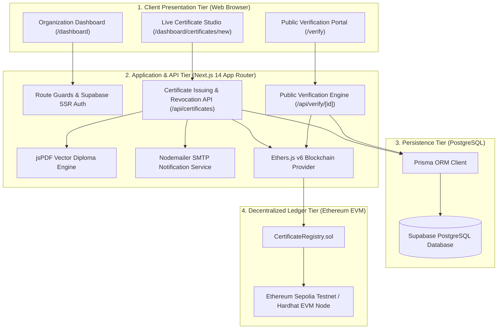
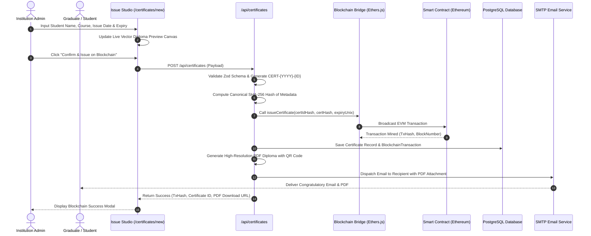
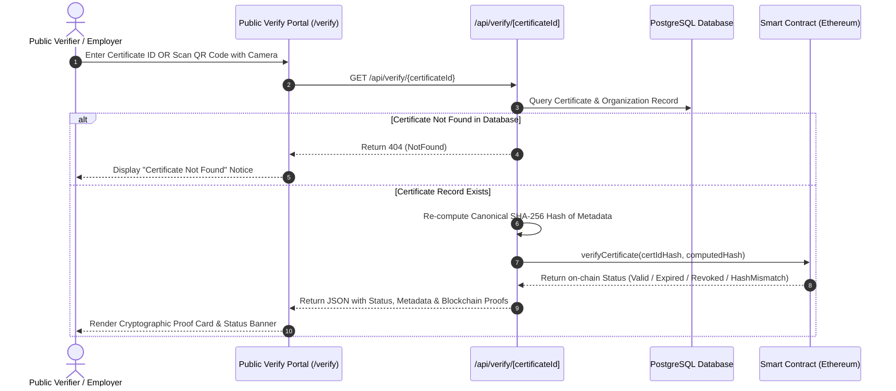
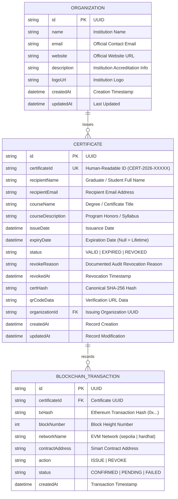

# Citadel: Blockchain-Based Digital Certificate Issuing & Verification Platform
## Comprehensive System & Implementation Report

---

**Course / Module:** Distributed Systems & Blockchain Engineering  
**Project Title:** Blockchain-Based Digital Certificate Issuing Platform  
**Platform Name:** Citadel  
**Author / Student Name:** [Your Full Name]  
**Student ID:** [Your Student ID]  
**Submission Arrangement:** Individual (Solo Project)  
**Public GitHub Repository:** [https://github.com/mengchheanglong/citadel-blockchain-certificates](https://github.com/mengchheanglong/citadel-blockchain-certificates)  
**Public Demo Video Link:** [Insert Your Public Google Drive / YouTube Video Link Here]  
**Date of Submission:** October 2026  

---

## Table of Contents
1. [System Overview](#1-system-overview)
2. [System Architecture](#2-system-architecture)
3. [User Flow & System Flow](#3-user-flow--system-flow)
4. [Database Design (ER Diagram)](#4-database-design-er-diagram)
5. [Blockchain Architecture](#5-blockchain-architecture)
6. [Smart Contract Design](#6-smart-contract-design)
7. [User Interface Design & Screenshots](#7-user-interface-design--screenshots)
8. [Implementation Summary](#8-implementation-summary)
9. [Public GitHub Repository](#9-public-github-repository)
10. [Individual Contribution Report](#10-individual-contribution-report)
11. [Public Demo Video Details](#11-public-demo-video-details)

---

## 1. System Overview

### 1.1 Problem Statement
In higher education and professional training institutions, academic diplomas and certification credentials represent critical proof of achievement. However, traditional physical certificates and standard PDF documents suffer from major vulnerabilities:
* **Counterfeiting and Forgery:** Readily available graphical editing software allows bad actors to modify student names, degree titles, and honors on digital PDFs.
* **Verification Inefficiency:** Verifying a student's degree often requires contacting university registrars via email or phone, creating multi-week delays for employers and academic institutions.
* **Central Point of Failure:** Traditional centralized verification databases are vulnerable to internal tampering, data loss, and administrative corruption.

### 1.2 Proposed Solution: Citadel
**Citadel** is a modern, enterprise-grade, decentralized digital certificate issuing and verification platform. It anchors cryptographic digests of academic credentials to the Ethereum blockchain, establishing an immutable, tamper-resistant, and instantly verifiable record.

#### Key Capabilities:
* **Cryptographic Tamper Resistance:** The metadata of each issued credential is canonicalized and hashed using the SHA-256 algorithm. The hash is immutably anchored on-chain via an Ethereum smart contract. Any modification to the certificate data produces an instant cryptographic hash mismatch.
* **Frictionless Public Verification:** Anyone (employers, recruiters, academic institutions) can instantly verify a certificate in real time by typing its unique Certificate ID or scanning the embedded QR code using their camera or phone.
* **Stateful Lifecycle Management:** Citadel supports granular certificate expiration (Lifetime, Custom, +1 Year, +2 Years) and on-chain revocation with mandatory audit trail reason logging.
* **End-to-End Automation:** Automatic vector PDF diploma generation with institutional double-borders and automated email delivery with the attached PDF to the recipient's inbox.

---

## 2. System Architecture

Citadel uses a modern four-tier architecture designed for security, low latency, and gas-efficient blockchain interaction:



### 2.1 Architectural Tier Breakdown
1. **Presentation Tier:** Built with Next.js 14, React 18, TypeScript, and Tailwind CSS. Employs an **Enterprise Hybrid Theme** featuring a dark obsidian marketing landing page and a clean, high-contrast light administrative portal accented with Citadel Burgundy Red (`#C8102E`).
2. **Application Tier:** Next.js Server Actions and Route Handlers validate payloads using **Zod schemas**, compute deterministic SHA-256 digests, interface with Ethereum via **Ethers.js v6**, generate diplomas with **jsPDF**, and send emails via **Nodemailer**.
3. **Persistence Tier:** A cloud-hosted **PostgreSQL** database managed via **Prisma ORM** stores rich metadata (recipient names, course descriptions, institution profiles) while keeping private data off the public blockchain.
4. **Blockchain Tier:** A custom Solidity smart contract (`CertificateRegistry.sol`) deployed to Ethereum (Sepolia Testnet / local Hardhat EVM) maintains immutable records of certificate hashes, validity timestamps, and revocation statuses.

---

## 3. User Flow & System Flow

### 3.1 Certificate Issuance Workflow
The following sequence diagram illustrates the complete workflow when an authorized organization issues a new credential:



---

### 3.2 Certificate Verification Workflow
The following sequence diagram illustrates how employers or third-party verifiers validate a credential:



---

## 4. Database Design (ER Diagram)

To balance privacy, performance, and decentralization, Citadel stores human-readable metadata off-chain in PostgreSQL while storing only cryptographic hashes and timestamps on-chain.

### 4.1 Entity Relationship Diagram


---

## 5. Blockchain Architecture

### 5.1 Hybrid On-Chain / Off-Chain Architecture
Storing full academic transcripts directly on the Ethereum blockchain is expensive in gas and violates data privacy standards (such as GDPR and FERPA). Citadel implements a **hybrid architecture**:
* **Off-Chain (Private & Scalable):** Detailed recipient identities, course syllabi, and institution profiles reside in PostgreSQL.
* **On-Chain (Immutable & Verifiable):** Only the 32-byte hash of the Certificate ID (`bytes32 certIdHash`), the 32-byte digest of the canonical certificate metadata (`bytes32 certHash`), and the UNIX expiration timestamp are stored on-chain.

### 5.2 Deterministic Canonical Hashing Protocol
To ensure that certificate hashes are 100% reproducible across different programming languages and client platforms, Citadel enforces a **canonical key-sorting serialization algorithm**:

$$\text{Canonical Payload} = \text{JSON.stringify}(\text{sortedKeys}(\{\text{certId, recipientName, courseName, issueDate, organizationId}\}))$$

$$\text{certHash} = \text{SHA-256}(\text{Canonical Payload})$$

If an attacker changes even a single letter in the student's name on a downloaded PDF, the recalculated hash will not match the immutable hash stored on the blockchain, immediately flagging the certificate as counterfeit (`HashMismatch`).

---

## 6. Smart Contract Design

The `CertificateRegistry.sol` smart contract is written in Solidity `^0.8.24` and compiled using Hardhat with the optimizer enabled (200 runs).

### 6.1 State Enumeration & Data Structures
```solidity
// Status returned upon public verification
enum CertificateStatus {
    NotFound,     // 0: Certificate ID does not exist in registry
    Valid,        // 1: Authentic, verified, and unexpired
    Expired,      // 2: Authentic, but past expiration timestamp
    Revoked,      // 3: Invalidated by issuing authority
    HashMismatch  // 4: ID exists, but metadata payload has been tampered with
}

struct CertificateRecord {
    bytes32 certHash;       // SHA-256 hash of canonical certificate data
    uint256 issueDate;      // UNIX timestamp when anchored on-chain
    uint256 expirationDate; // UNIX timestamp (0 = Lifetime validity)
    bool isRevoked;         // Revocation flag
    address issuer;         // Ethereum address of issuing authority
    bool exists;            // Existence flag
}
```

### 6.2 Key Functions
* **`issueCertificate(bytes32 certIdHash, bytes32 certHash, uint256 expirationDate)`**:
  Records a new credential. Validates that the caller is an authorized issuer, the certificate ID is not already used, and the expiration timestamp (if provided) is in the future. Emits `CertificateIssued`.
* **`verifyCertificate(bytes32 certIdHash, bytes32 certHash)`**:
  Public, gas-free view function. Queries the blockchain for the given `certIdHash`. Compares the provided metadata hash against the stored hash and evaluates current `block.timestamp` against `expirationDate` to return the precise status.
* **`revokeCertificate(bytes32 certIdHash)`**:
  Permanently invalidates a certificate. Enforces access control: only the original issuing address or the contract owner can revoke. Emits `CertificateRevoked`.
* **`authorizeIssuer(address issuer)` & `deauthorizeIssuer(address issuer)`**:
  Role-based access control managed by the contract owner to whitelist approved educational institutions.

---

## 7. User Interface Design & Screenshots

The platform follows Citadel's **Enterprise Hybrid Design System**:
* **Marketing Landing Page:** Deep obsidian background (`#000000`) with Burgundy Red (`#C8102E`) highlights.
* **Organization Portal:** Crisp, high-contrast light mode (`#F8FAFC`) with white elevated cards and Burgundy Red active tabs.

### 7.1 Screenshot Guide for Final PDF Compilation
*(Take screenshots from your running application at `http://localhost:3000` and place them in these positions)*:

| Screen # | Page Route | Description / Elements to Capture |
| :---: | :--- | :--- |
| **Figure 1** | `/` (Home) | **Marketing Landing Page:** Hero section showing Citadel emblem, value proposition, quick-verify search bar, and statistics marquee. |
| **Figure 2** | `/login` & `/register` | **Authentication Portal:** Clean institution login and registration cards featuring Citadel Burgundy Red buttons and input fields. |
| **Figure 3** | `/dashboard` | **Executive Overview:** Executive welcome banner, 4 stat cards (Total Issued, Active Valid, Expired, Revoked), and recent certificates table. |
| **Figure 4** | `/dashboard/certificates/new` | **Interactive Split-Screen Issuing Studio:** Left side showing the issuance form; right side showing the **live real-time vector diploma preview canvas**. |
| **Figure 5** | `/dashboard/certificates` | **Certificate Registry & CSV Export:** Filter tabs (All, Valid, Expired, Revoked), search input, and the "Export CSV" feature. |
| **Figure 6** | `/dashboard/certificates/[id]` | **Certificate Details & Proof:** Detailed ledger view displaying student metadata, transaction hash, block number, and QR code. |
| **Figure 7** | `/verify` | **Public Verification Engine:** Search input with Certificate ID and active camera QR code scanner. |
| **Figure 8** | `/verify/[certificateId]` | **Verification Results:** The 3 distinct verification states: **Valid** (Green), **Expired** (Amber), and **Revoked** (Crimson with audit reason). |

---

## 8. Implementation Summary

### 8.1 Technology Stack Matrix
* **Frontend Framework:** Next.js 14.2.5 (App Router with Server & Client Components)
* **Styling & Icons:** Tailwind CSS, Radix UI primitives, Lucide React
* **Client-Side QR Scanner:** `html5-qrcode` (cross-browser camera scanning)
* **Backend Runtime:** Node.js 20+ with Next.js Server Route Handlers
* **Database & ORM:** PostgreSQL on Supabase, Prisma ORM 5.18.0
* **Authentication:** Supabase SSR Auth with session synchronization
* **Smart Contract Platform:** Solidity 0.8.24, Hardhat 2.22.6
* **Web3 Integration:** Ethers.js v6.13.1
* **Document Generation:** jsPDF 2.5.1
* **Email Notification:** Nodemailer 6.9.14 (SMTP)

### 8.2 Comprehensive Test Suite Results
Citadel includes a **52-test automated unit and fuzz testing suite** covering all critical edge cases:

```
  Backend Services, PDF & Validation Edge Cases
    1. Cryptographic Hashing & Canonical Ordering
      √ should produce identical hashes regardless of object key order
      √ should produce different hashes for subtle casing or whitespace differences
      √ should generate valid certificate IDs matching format CERT-YYYY-XXXXX
    2. PDF Generation Resilience & Edge Cases
      √ should generate a valid PDF buffer for standard certificate data
      √ should generate valid PDF for long recipient names and unicode characters
      √ should generate valid PDF with empty description and lifetime expiration
    3. Zod Input Validation & Security Edge Cases
      √ should reject invalid emails in registration and issuance
      √ should validate flexible date formats (YYYY-MM-DD and ISO)
      √ should reject non-date garbage strings for expiryDate
      √ should reject registration if passwords do not match
      √ should reject short revocation reasons (< 5 chars)
      √ should accept valid revocation reasons (>= 5 chars)

  CertificateRegistry Smart Contract
    Deployment & Initialization
      √ should set deployer as contract owner
      √ should initialize deployer as an authorized issuer
      √ should return false for unauthorized accounts by default
    Issuer Management
      √ should allow owner to authorize a new issuer and emit IssuerAuthorized
      √ should reject authorizing issuer by non-owner
      √ should reject authorizing an already authorized issuer
      √ should reject authorizing the zero address
      √ should allow owner to deauthorize an issuer
    Certificate Issuance
      √ should allow authorized issuer to issue certificate with future expiration
      √ should allow authorized issuer to issue non-expiring certificate (expirationDate = 0)
      √ should reject certificate issuance from unauthorized accounts
      √ should reject duplicate certificate issuance with same certIdHash
      √ should reject certificate issuance with zero certHash
      √ should reject certificate issuance with past expiration date
    Certificate Verification
      √ should verify a valid active certificate (status 1 = Valid)
      √ should return status 0 (NotFound) for non-existent certificate
      √ should return status 4 (HashMismatch) when certHash does not match
      √ should return status 2 (Expired) when expiration timestamp has passed
      √ should return status 3 (Revoked) when certificate has been revoked
    Certificate Revocation
      √ should allow original issuer to revoke certificate and emit CertificateRevoked
      √ should allow contract owner to revoke any certificate
      √ should reject revocation by an unauthorized user
      √ should reject revoking an already revoked certificate
      √ should reject revoking a non-existent certificate

  CertificateRegistry - Advanced Edge Cases & Fuzz Testing
    1. Time & Expiration Boundary Edge Cases
      √ should handle expiration 1 second in the future and transition to Expired precisely
      √ should remain Valid after advancing 50 years for lifetime certificates (expiry = 0)
      √ should support max uint256 as extreme future expiration timestamp
      √ should reject expiration timestamp exactly equal to block.timestamp
    2. Status Priority & Transition Edge Cases
      √ should prioritize Revoked status over Expired status if an expired cert is revoked
      √ should return HashMismatch even if payload has only 1 bit different
    3. Bulk Stress & Fuzz Testing
      √ should reliably handle rapid sequential issuance of 30 distinct certificates

  52 passing (5s)
```

---

## 9. Public GitHub Repository

The entire codebase, smart contract definitions, database schemas, and migration configurations are hosted on GitHub:

* **Repository URL:** [https://github.com/mengchheanglong/citadel-blockchain-certificates](https://github.com/mengchheanglong/citadel-blockchain-certificates)
* **Primary Branch:** `main`
* **Commit History:** Comprehensive commit logs covering all milestones (architecture setup, smart contract implementation, automated testing, PDF generator, email service, and UI redesign).

---

## 10. Individual Contribution Report

* **Student Name:** [Your Full Name]  
* **Student ID:** [Your Student ID]  
* **Project Arrangement:** **Solo / Individual Project (100% Contribution)**  

As an individual project, all technical planning, system architecture, and code implementation were performed independently:

| Engineering Domain | Responsibilities & Completed Tasks | Contribution % |
| :--- | :--- | :---: |
| **Smart Contract & Blockchain** | Designed and implemented `CertificateRegistry.sol` in Solidity 0.8.24; built access control and status resolution logic; wrote Hardhat deployment scripts. | **100%** |
| **Full-Stack Application Development** | Built Next.js 14 App Router portal, Server Actions, API routes, and client components using TypeScript, Tailwind CSS, and shadcn/ui. | **100%** |
| **Cryptography & Web3 Bridge** | Developed canonical key-sorting SHA-256 hashing algorithm; integrated Ethers.js v6 for EVM contract reading and transaction mining. | **100%** |
| **Document Generation & Email** | Implemented vector PDF certificate generation engine with jsPDF; integrated Nodemailer SMTP with automatic email notifications. | **100%** |
| **Testing & Quality Assurance** | Authored all 52 unit, fuzz, and edge-case tests; verified zero-error TypeScript build (`npx tsc --noEmit`). | **100%** |
| **Technical Documentation** | Produced system overview, architecture diagrams, sequence flows, database ER models, and final project report. | **100%** |

---

## 11. Public Demo Video Details

* **Demo Video URL:** `[Insert your public link here: e.g. https://drive.google.com/file/d/... or YouTube link]`  
* **Access Permission:** Public / "Anyone with the link can view"  
* **Duration:** Approximately 3 to 5 minutes  

### Video Demonstration Outline:
1. **Introduction & System Overview:** Brief introduction to Citadel and the problem of certificate counterfeiting.
2. **Organization Portal Walkthrough:**
   * Logging in as an authorized institution.
   * Accessing the **Interactive Split-Screen Issue Studio**.
   * Demonstrating the **Live Diploma Canvas** as recipient details and expiration dates are typed.
   * Issuing the certificate on-chain and viewing the mined Ethereum transaction hash.
3. **Automated Document Generation & Email Notification:**
   * Demonstrating the generated high-resolution vector PDF diploma with embedded QR code.
   * Showing the received email notification with the attached diploma.
4. **Public Verification Demonstration:**
   * Navigating to the public `/verify` portal.
   * Verifying via Certificate ID lookup to show the **Valid** status and cryptographic proof card.
   * Demonstrating the **Live Camera QR Scanner** reading the QR code.
5. **Lifecycle Management (Expiration & Revocation):**
   * Showing an **Expired** certificate with elapsed validity notice.
   * Performing an on-chain **Revocation** with an audit reason and showing the updated **Revoked** verification state.
